

# 卡尔曼滤波原理

## 1. 什么是卡尔曼滤波？

你可以在任何含有不确定信息的动态系统中使用卡尔曼滤波，对系统下一步的走向做出有根据的预测，即使伴随着各种干扰，卡尔曼滤波总是能指出真实发生的情况。

在连续变化的系统中使用卡尔曼滤波是非常理想的，它具有占用内存小的优点(除了前一个状态量外，不需要保留其它历史数据)，并且速度很快，很适合应用于实时问题和嵌入式系统。

在Google上找到的大多数关于实现卡尔曼滤波的数学公式看起来有点晦涩难懂，这个状况有点糟糕。实际上，如果以正确的方式看待它，卡尔曼滤波是非常简单和容易理解的，下面我将用漂亮的图片和色彩清晰的阐述它，你只需要懂一些基本的概率和矩阵的知识就可以了。

## 2. 我们能用卡尔曼滤波做什么?

用玩具举例：你开发了一个可以在树林里到处跑的小机器人，这个机器人需要知道它所在的确切位置才能导航。

我们可以说机器人有一个状态 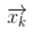，表示位置和速度：

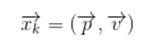

注意这个状态只是关于这个系统基本属性的一堆数字，它可以是任何其它的东西。在这个例子中是位置和速度，它也可以是一个容器中液体的总量，汽车发动机的温度，用户手指在触摸板上的位置坐标，或者任何你需要跟踪的信号。

这个机器人带有$GPS$，精度大约为10米，还算不错，但是，它需要将自己的位置精确到10米以内。树林里有很多沟壑和悬崖，如果机器人走错了一步，就有可能掉下悬崖，所以只有GPS是不够的。

或许我们知道一些机器人如何运动的信息：例如，机器人知道发送给电机的指令，知道自己是否在朝一个方向移动并且没有人干预，在下一个状态，机器人很可能朝着相同的方向移动。当然，机器人对自己的运动是一无所知的：它可能受到风吹的影响，轮子方向偏了一点，或者遇到不平的地面而翻倒。所以，轮子转过的长度并不能精确表示机器人实际行走的距离，预测也不是很完美。

GPS 传感器告诉了我们一些状态信息，我们的预测告诉了我们机器人会怎样运动，但都只是间接的，并且伴随着一些不确定和不准确性。但是，如果使用所有对我们可用的信息，我们能得到一个比任何依据自身估计更好的结果吗?回答当然是YES，这就是卡尔曼滤波的用处。

## 3. 卡尔曼滤波是如何看到你的问题的

下面我们继续以只有位置和速度这两个状态的简单例子做解释。

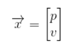

我们并不知道实际的位置和速度，它们之间有很多种可能正确的组合，但其中一些的可能性要大于其它部分：

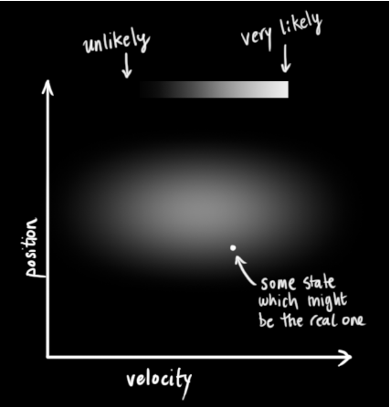

卡尔曼滤波假设两个变量(位置和速度，在这个例子中)都是随机的，并且服从高斯分布。每个变量都有一个均值 μ，表示随机分布的中心(最可能的状态)，以及方差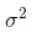，表示不确定性。

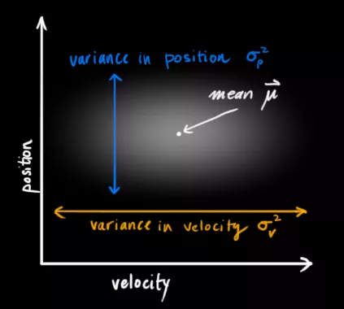

在上图中，位置和速度是不相关的，这意味着由其中一个变量的状态无法推测出另一个变量可能的值。下面的例子更有趣：位置和速度是相关的，观测特定位置的可能性取决于当前的速度：

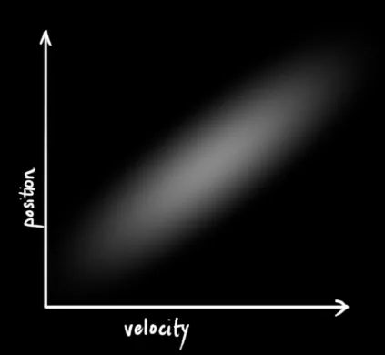

这种情况是有可能发生的，例如，我们基于旧的位置来估计新位置。如果速度过高，我们可能已经移动很远了。如果缓慢移动，则距离不会很远。跟踪这种关系是非常重要的，因为它带给我们更多的信息：其中一个测量值告诉了我们其它变量可能的值，这就是卡尔曼滤波的目的，尽可能地在包含不确定性的测量数据中提取更多信息!

这种相关性用协方差矩阵来表示，简而言之，矩阵中的每个元素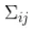表示第 i 个和第 j 个状态变量之间的相关度。（你可能已经猜到协方差矩阵是一个对称矩阵，这意味着可以任意交换 i 和 j）。协方差矩阵通常用“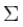”来表示，其中的元素则表示为“”。

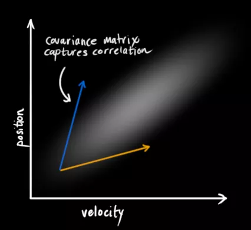

## 4. 使用矩阵来描述问题

我们基于高斯分布来建立状态变量，所以在时刻 `k` 需要两个信息：最佳估计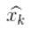(即均值，其它地方常用 `μ` 表示)，以及协方差矩阵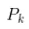。

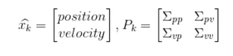  (1)

(当然，在这里我们只用到了位置和速度，实际上这个状态可以包含多个变量，代表任何你想表示的信息)。接下来，我们需要根据**当前状态**(`k-1` 时刻)来预测**下一状态**(`k` 时刻)。记住，我们并不知道对下一状态的所有预测中哪个是“真实”的，但我们的预测函数并不在乎。它对所有的可能性进行预测，并给出新的高斯分布。

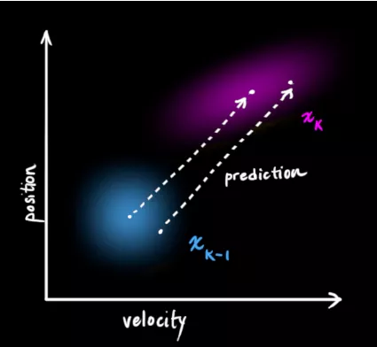

我们可以用矩阵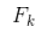来表示这个预测过程：

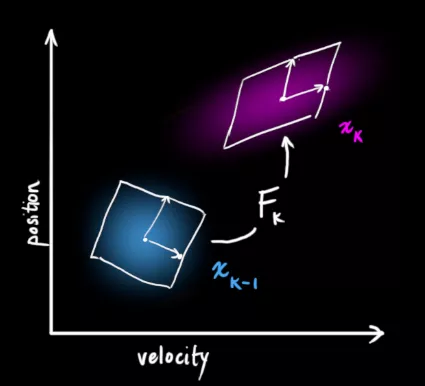

它将我们原始估计中的每个点都移动到了一个新的预测位置，如果原始估计是正确的话，这个新的预测位置就是系统下一步会移动到的位置。那我们又如何用矩阵来预测下一个时刻的位置和速度呢?下面用一个基本的运动学公式来表示：

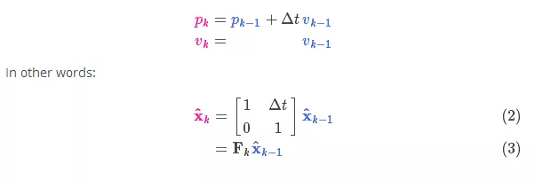

现在，我们有了一个预测矩阵来表示下一时刻的状态，但是，我们仍然不知道怎么更新协方差矩阵。此时，我们需要引入另一个公式，如果我们将分布中的每个点都乘以矩阵 A，那么它的协方差矩阵会怎样变化呢?很简单，下面给出公式：

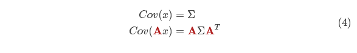

结合方程(4)和(3)得到：

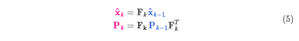

## 5. 外部控制量

我们并没有捕捉到一切信息，可能存在外部因素会对系统进行控制，带来一些与系统自身状态没有相关性的改变。

以火车的运动状态模型为例，火车司机可能会操纵油门，让火车加速。相同地，在我们机器人这个例子中，导航软件可能会发出一个指令让轮子转向或者停止。如果知道这些额外的信息，我们可以用一个向量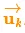来表示，将它加到我们的预测方程中做修正。

假设由于油门的设置或控制命令，我们知道了期望的加速度，根据基本的运动学方程可以得到：

以矩阵的形式表示就是：

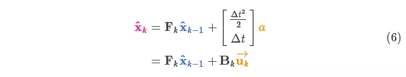

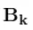称为控制矩阵，称为控制向量(对于没有外部控制的简单系统来说，这部分可以忽略)。让我们再思考一下，如果我们的预测并不是100%准确的，该怎么办呢?

## 6. 外部干扰

如果这些状态量是基于系统自身的属性或者已知的外部控制作用来变化的，则不会出现什么问题。

但是，如果存在未知的干扰呢?例如，假设我们跟踪一个四旋翼飞行器，它可能会受到风的干扰，如果我们跟踪一个轮式机器人，轮子可能会打滑，或者路面上的小坡会让它减速。这样的话我们就不能继续对这些状态进行跟踪，如果没有把这些外部干扰考虑在内，我们的预测就会出现偏差。

在每次预测之后，我们可以添加一些新的不确定性来建立这种与“外界”(即我们没有跟踪的干扰)之间的不确定性模型：

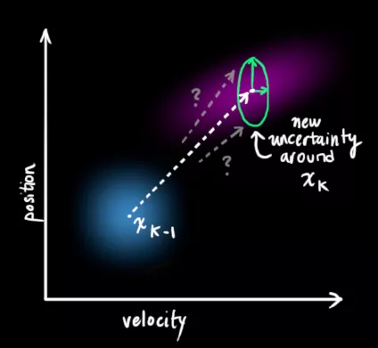

原始估计中的每个状态变量更新到新的状态后，仍然服从高斯分布。我们可以说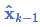的每个状态变量移动到了一个新的服从高斯分布的区域，协方差为。换句话说就是，我们将这些没有被跟踪的干扰当作协方差为的噪声来处理。

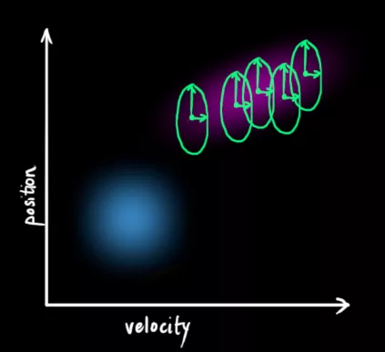

这产生了具有不同协方差(但是具有相同的均值)的新的高斯分布。

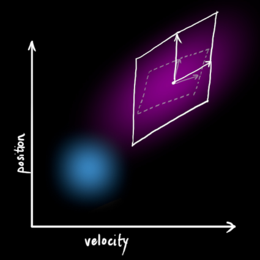

我们通过简单地添加得到扩展的协方差，下面给出预测步骤的完整表达式：

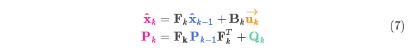

由上式可知，**新的最优估计**是根据**上一最优估计**预测得到的，并加上已知外部控制量的修正。

而**新的不确定性**由**上一不确定性**预测得到，并加上外部环境的干扰。

好了，我们对系统可能的动向有了一个模糊的估计，用和来表示。如果再结合传感器的数据会怎样呢?

## 7. 用测量值来修正估计值

我们可能会有多个传感器来测量系统当前的状态，哪个传感器具体测量的是哪个状态变量并不重要，也许一个是测量位置，一个是测量速度，每个传感器间接地告诉了我们一些状态信息。

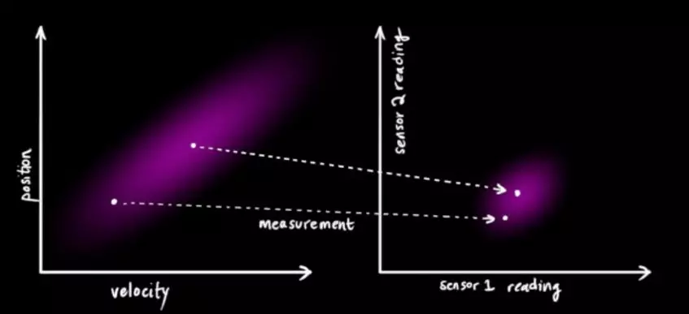

注意，传感器读取的数据的单位和尺度有可能与我们要跟踪的状态的单位和尺度不一样，我们用矩阵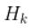来表示传感器的数据。

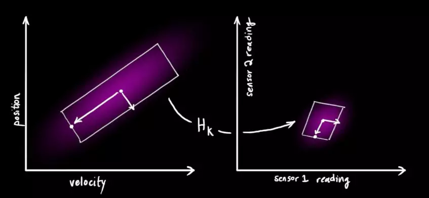

我们可以计算出传感器读数的分布，用之前的表示方法如下式所示：

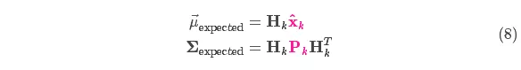

卡尔曼滤波的一大优点就是能处理传感器噪声，换句话说，我们的传感器或多或少都有点不可靠，并且原始估计中的每个状态可以和一定范围内的传感器读数对应起来。

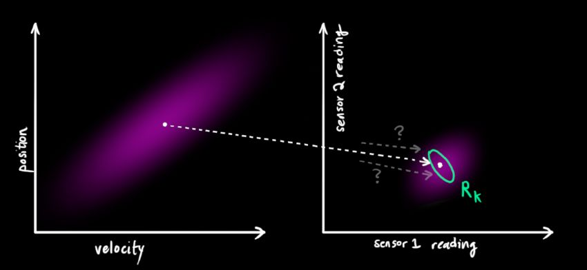

从测量到的传感器数据中，我们大致能猜到系统当前处于什么状态。但是由于存在不确定性，某些状态可能比我们得到的读数更接近真实状态。

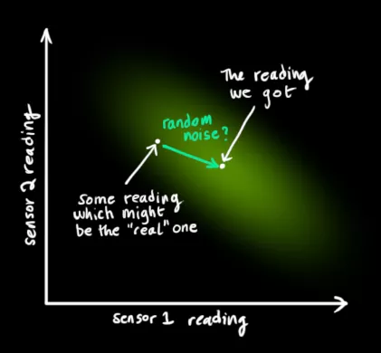

我们将这种不确定性(例如：传感器噪声)用协方差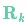表示，该分布的均值就是我们读取到的传感器数据，称之为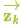。

现在我们有了两个高斯分布，一个是在预测值附近，一个是在传感器读数附近。

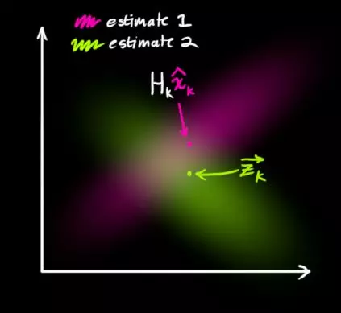

我们必须在预测值(粉红色)和传感器测量值(绿色)之间找到最优解。

那么，我们最有可能的状态是什么呢?对于任何可能的读数 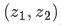，有两种情况：(1)传感器的测量值;(2)由前一状态得到的预测值。如果我们想知道这两种情况都可能发生的概率，将这两个高斯分布相乘就可以了。

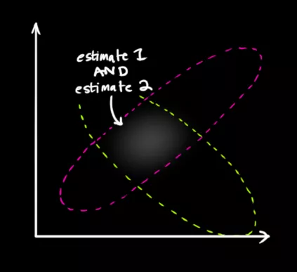

剩下的就是重叠部分了，这个重叠部分的均值就是两个估计最可能的值，也就是给定的所有信息中的最优估计。

瞧!这个重叠的区域看起来像另一个高斯分布。

如你所见，把两个具有不同均值和方差的高斯分布相乘，你会得到一个新的具有独立均值和方差的高斯分布!下面用公式讲解。

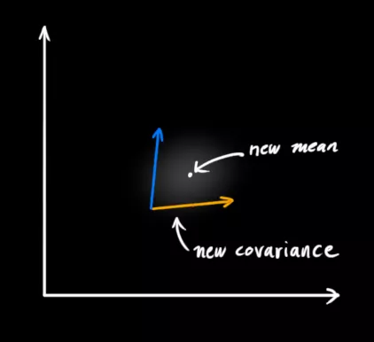

## 8. 融合高斯分布

先以一维高斯分布来分析比较简单点，具有方差和 `μ` 的高斯曲线可以用下式表示：

如果把两个服从高斯分布的函数相乘会得到什么呢?

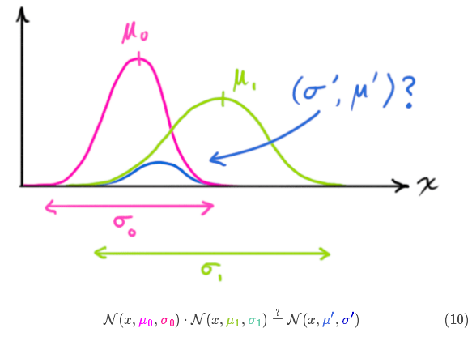

将式(9)代入到式(10)中(注意重新归一化，使总概率为1)可以得到：

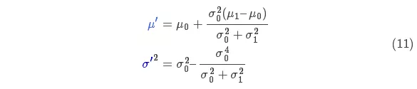

将式(11)中的两个式子相同的部分用 k 表示：

下面进一步将式(12)和(13)写成矩阵的形式，如果 Σ 表示高斯分布的协方差，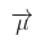表示每个维度的均值，则：

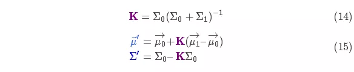

矩阵称为卡尔曼增益，下面将会用到。放松!我们快要完成了!

## 9. 将所有公式整合起来

我们有两个高斯分布，预测部分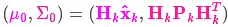，和测量部分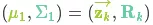，将它们放到式(15)中算出它们之间的重叠部分：

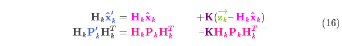

由式(14)可得卡尔曼增益为：

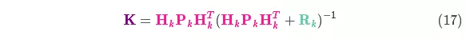

将式(16)和式(17)的两边同时左乘矩阵的逆(注意里面包含了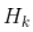)将其约掉，再将式(16)的第二个等式两边同时右乘矩阵的逆得到以下等式：

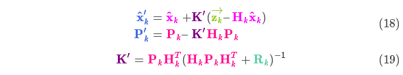

上式给出了完整的更新步骤方程。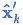就是新的最优估计，我们可以将它和放到下一个预测和更新方程中不断迭代。

## 10. 总结

以上所有公式中，你只需要用到式(7)、(18)、(19)。(如果忘了的话，你可以根据式(4)和(15)重新推导一下)

我们可以用这些公式对任何线性系统建立精确的模型，对于非线性系统来说，我们使用扩展卡尔曼滤波，区别在于EKF多了一个把预测和测量部分进行线性化的过程。