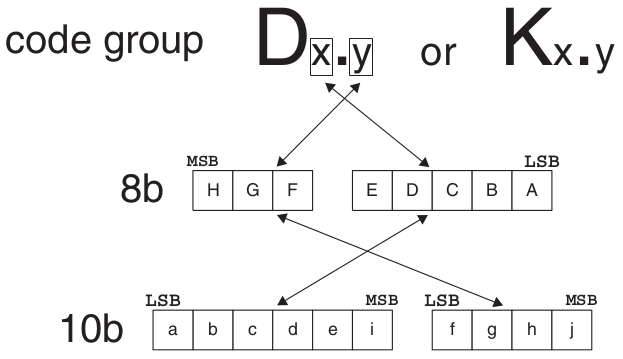
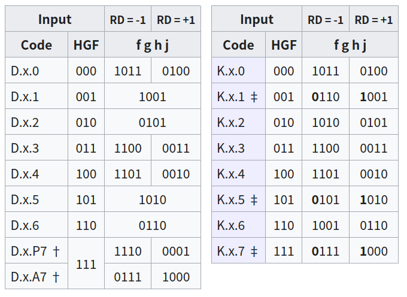
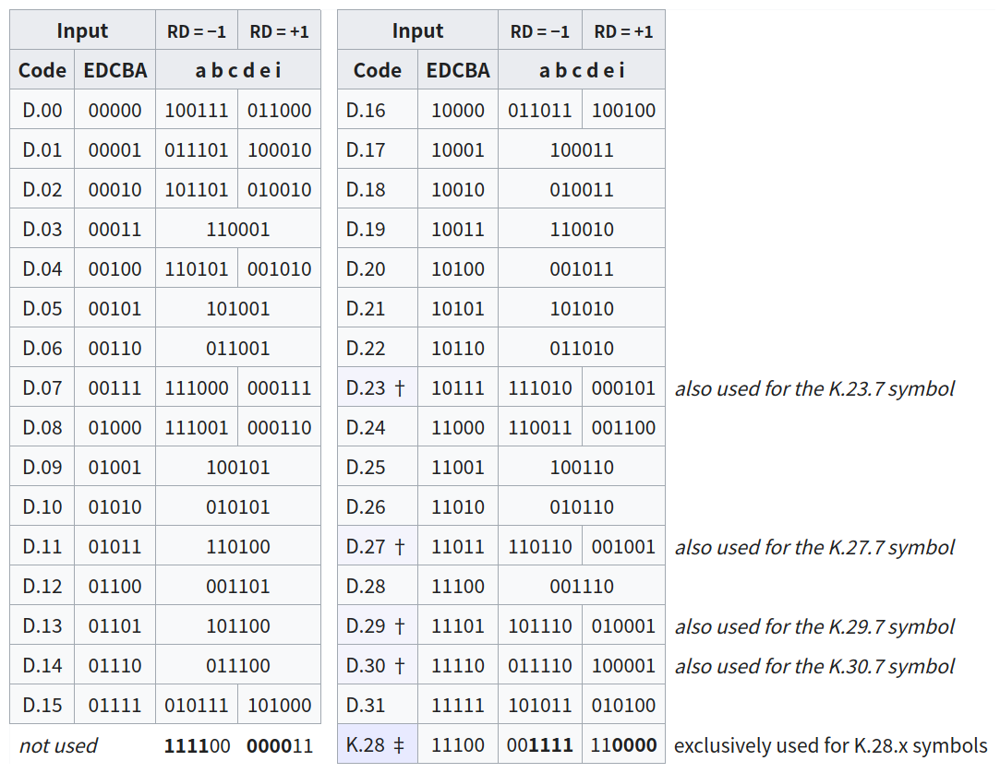
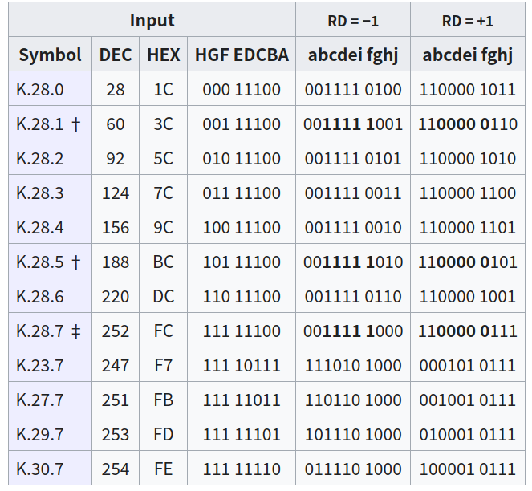
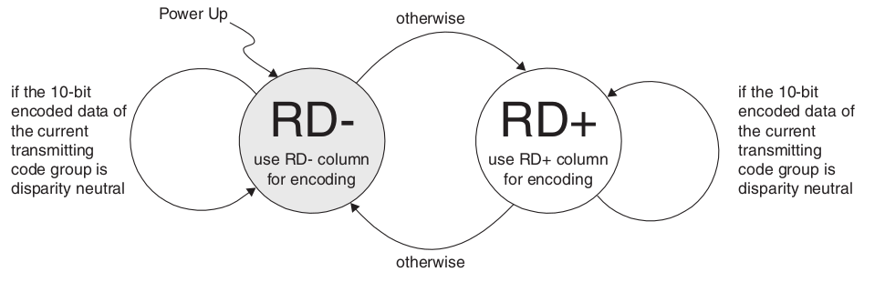

# 8B/10B

- **Run length**: the maximum numbers of contiguous 0s or 1s in the serial data stream

- **Disparity**: disparity of a block is calculated by the number of 1s minus the number of 0s.
    > The value of a block that has a zero disparity is called **disparity neutral**.
    > Disparity is not possible to be +1 or -1. It can only be -2, +2, or 0.

## 1. 8b/10b Code Mapping

The code groups include 256 data characters named Dx.y and 12 control characters named Kx.y.

##### Figure 1. 8B/10B Coding Scheme

## 2. 3-Bit to 4-Bit Encoding

† For D.x.7, either the Primary (D.x.P7), or the Alternate (D.x.A7) encoding must be selected in order to avoid a run of five consecutive 0s or 1s when combined with the preceding 5b/6b code.
Sequences of exactly five identical bits are used in comma symbols for synchronization issues.
D.x.A7 is used only

    when RD = −1: for x = 17, 18 and 20 and
    when RD = +1: for x = 11, 13 and 14.

With x = 23, x = 27, x = 29, and x = 30, the 3b/4b code portion used for control symbols K.x.7 is the same as that for D.x.A7.
Any other D.x.A7 code can't be used as it would result in chances for misaligned comma sequences.

‡ Only K.28.1, K.28.5, and K.28.7 generate comma symbols, that contain a bit sequence of five 0s or 1s.
The symbol has the format 110000 01xx or 001111 10xx. 

## 3. 5-Bit to 6-Bit Encoding

† also used for the 5b/6b code of K.x.7
‡ exclusively used for the 5b/6b code of K.28.y 

## 4. Control Symbols

The control symbols within 8b/10b are 10b symbols that are valid sequences of bits (no more than six 1s or 0s) but do not have a corresponding 8b data byte. They are used for low-level control functions. For instance, in Fibre Channel, K28.5 is used at the beginning of four-byte sequences (called "Ordered Sets") that perform functions such as Loop Arbitration, Fill Words, Link Resets, etc. 

† Within the control symbols, **K.28.1**, **K.28.5**, and **K.28.7** are "comma symbols". Comma symbols are used for synchronization (finding the alignment of the 8b/10b codes within a bit-stream). If **K.28.7** is not used, the unique comma sequences `00111110` or `11000001` cannot be found at any bit position within any combination of normal codes.

‡ If **K.28.7** is allowed in the actual coding, a more complex definition of the synchronization pattern than suggested by † needs to be used, as a combination of **K.28.7** with several other codes forms a false misaligned comma symbol overlapping the two codes. A sequence of multiple **K.28.7** codes is not allowable in any case, as this would result in undetectable misaligned comma symbols.

**K.28.7** is the only comma symbol that cannot be the result of a single bit error in the data stream. 

## 5. Running Disparity Transition

- The transmitter assumes a negative Running Disparity (RD-) at start up. When an 8-bit data is encoding, the encoder will use the **RD-** column for encoding. 

- If the 10-bit data been encoded is disparity neutral, the Running Disparity will not be changed and the **RD-** column will still be used. Otherwise, the Running Disparity will be changed and the **RD+** column will be used instead. 

- Similarly, if the current Running Disparity is positive (**RD+**) and a disparity neutral 10-bit data is encoded, the Running Disparity will still be **RD+**. Otherwise, it will be changed from **RD+** back to **RD-** and the **RD-** column will be used again..

##### Figure 2. Running Disparity State Machine