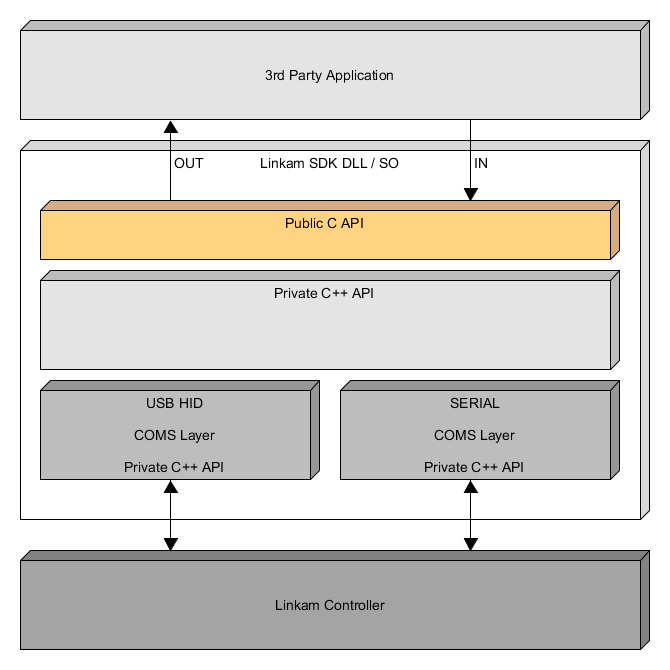
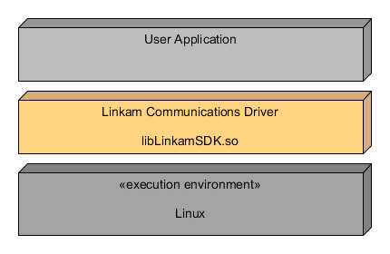
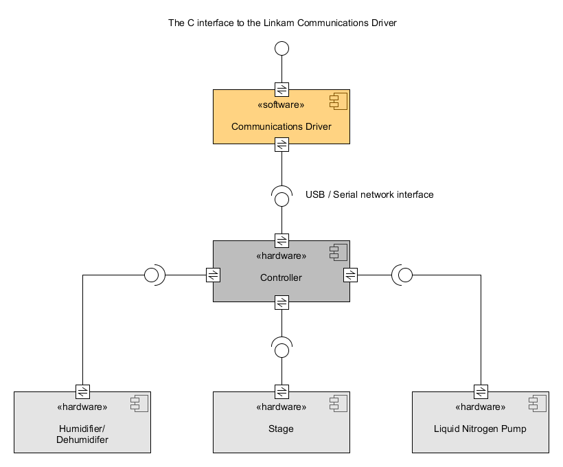
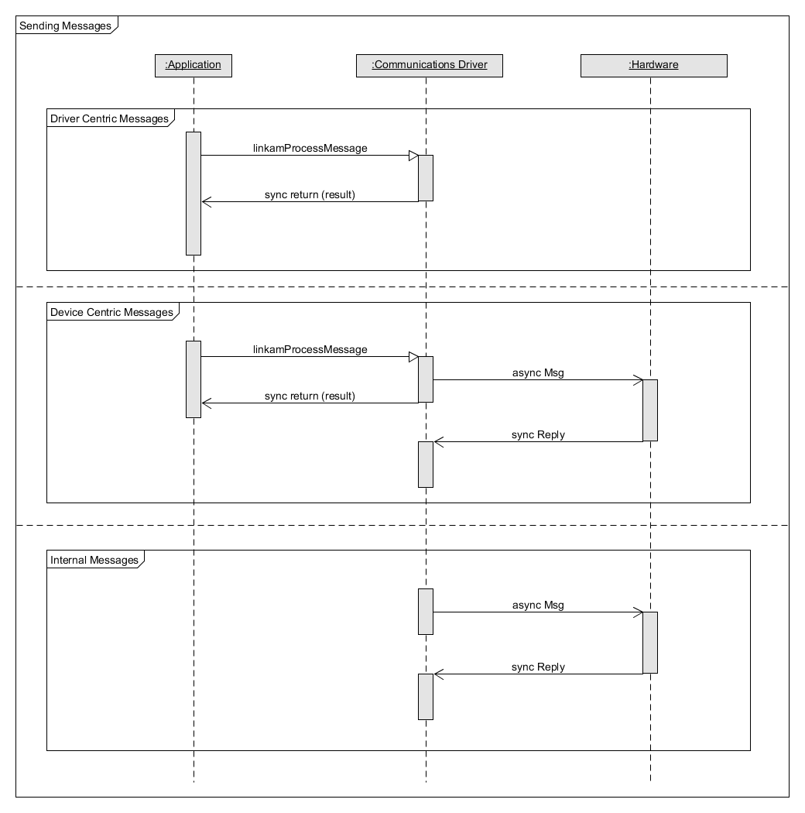
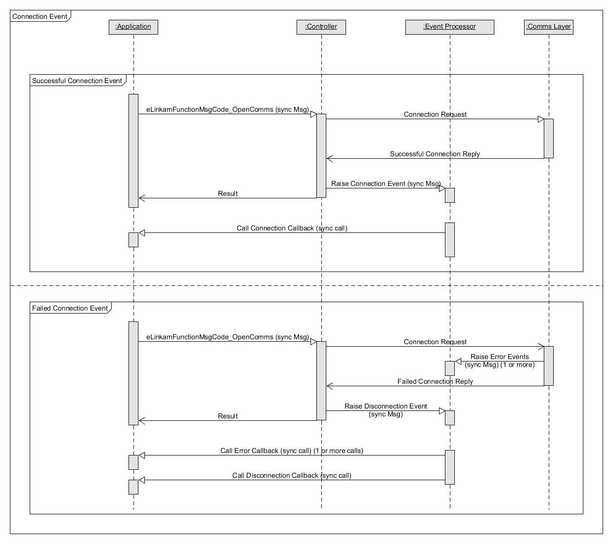
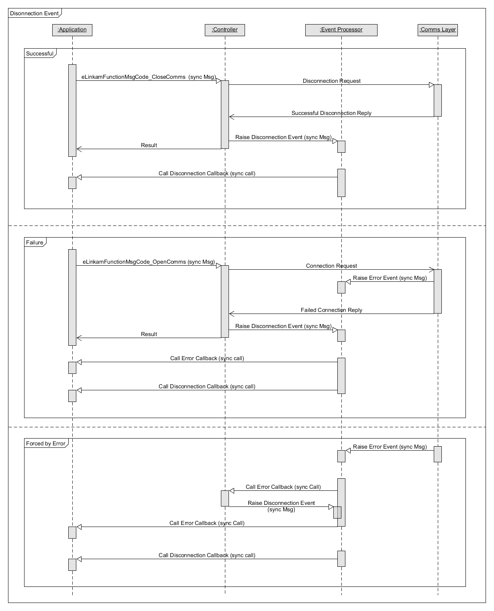
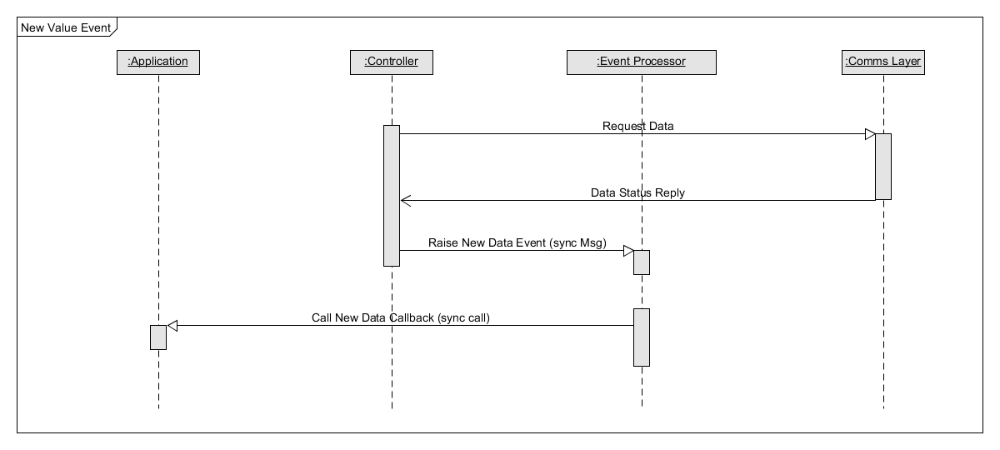
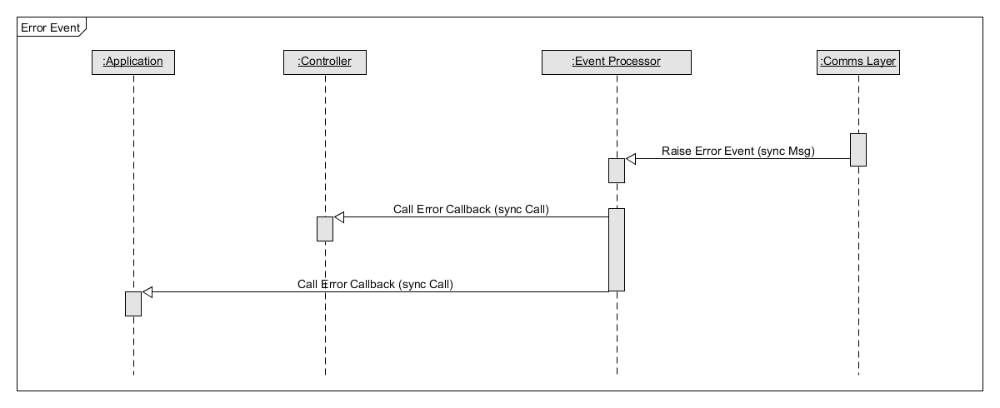

# Build Linkam T96 IOC Based on linkam3 SDK


## 1. Preparation

Linkam IOC depends on `libusb-1.0-0-dev`.

```bash
sudo apt-get install g++-multilib
sudo apt-get install libusb-1.0-0-dev
sudo apt-get install libudev-dev
```

## 2. Download source code

https://github.com/dls-controls/linkam3

## 3. Copy files

Copy `SDK/include/` to `linkamT96App/src/`.


## Appendix

- SDK Deployment



- Linux Driver Deployment



- Driver Interface



- Message Handling



- Events

    - Connection

    

    - Disconnection

    

    - New value

    

    - Error

    

