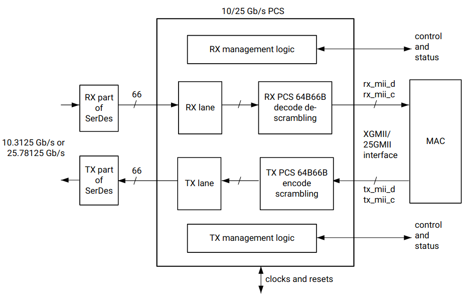
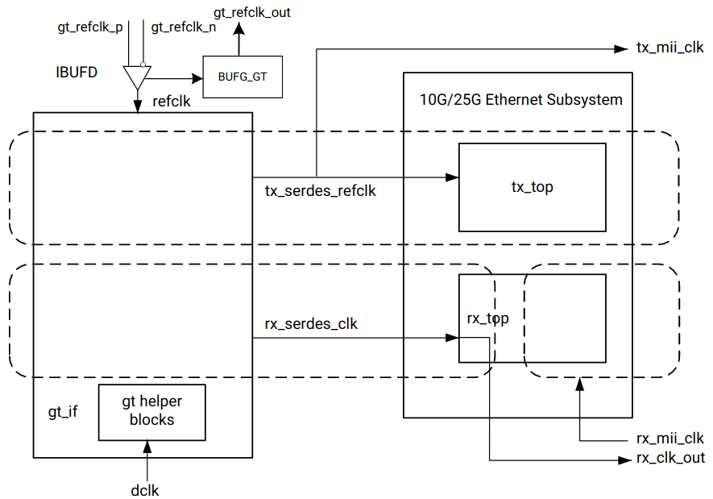

# 10GBase R PCS/PMA

## 1. Port definition

Name | I/O | Clock Domain | Description
:-:|:-:|:-:|:-:
gt_ref_clk | 
s_axi |
tx_mii_c[7:0] | I | tx_mii_clk | Transmit XGMII control bus
tx_mii_d[63:0] | I | tx_mii_clk | Transmit XGMII control bus
rx_mii_c[7:0] | O | rx_mii_clk | Receive XGMII Control bus
rx_mii_d[63:0] | O | rx_mii_clk | Receive XGMII Data bus
rx_core_clk |
txoutclksel_in[2:0] |
rxoutclksel_in[2:0] |
gtwiz_reset_tx_datapath |
gtwiz_reset_rx_datapath |
sys_reset |
dclk |
s_axi_aclk |
s_axi_aresetn |
pm_tick |
rx_reset |
tx_reset |
qpllreset_in |
|
gt_serial_port |
mii_rx |
stat_tx |
stat_rx |
rx_recclkout |
tx_mii_clk |
rx_clk_out |
gt_refclk_out |
gtpowergood_out |
user_rx_reset |
stat_rx_status |
user_tx_reset |
user_reg0[31:0] |
gt_rxn_in |
gt_rxp_in |
gt_txn_out |
gt_txp_out |

## 2. Design

### 2.1 PCS/PMA clocking

#### 2.1.1 64-bit clocking

- refclk_p0, refclk_n0, tx_serdes_refclk: The `refclk` differential pair is required to be an inputto the FPGA. The example design includes a buffer to convert this clock to a single-endedsignal `refclk`, which is used as the reference clock for the GT block. The `tx_serdes_refclk` is directly derived from `refclk`. Note that `refclk` must be chosen sothat the `tx_mii_clk` meets the requirements of 802.3, which is within 100 ppm of 390.625MHz for 25G and 156.25 MHz for 10G.

- tx_mii_clk: The `tx_mii_clk` is an output which is the same as the `tx_serdes_refclk`.The entire TX path is driven by this clock. You must synchronize the TX path `mii` bus to thisclock output. All TX control and status signals are referenced to this clock.

- rx_serdes_clk: The `rx_serdes_clk` is derived from the incoming data stream within the GTblock. The incoming data stream is processed by the RX core in this clock domain.

- rx_clk_out: The `rx_clk_out` output signal is presented as a reference for the RX control andstatus signals processed by the RX core. It is the same frequency as the `rx_serdes_clk`.

- rx_mii_clk: The `rx_mii_clk` input is required to be synchronized to the RX XGMII/25GMIIdata bus. This clock and the RX XGMII/25GMII bus must be within 100 ppm of the requiredfrequency, which is 390.625 MHz for 25G and 156.25 MHz for 10G.

- dclk: The `dclk` signal must be a convenient, stable clock. It is used as a reference frequencyfor the GT helper blocks which initiate the GT itself. In the example design, a typical value is75 MHz, which is readily derived from the 300 MHz clock available on the VCU107 evaluationboard. Note that the actual frequency must be known to the GT helper blocks for properoperation.

#### 2.1.2 32-bit clocking

- reclk_p0,refclk_n0rx_serdes_refclk: The refclk differential pair is required to be an input to theFPGA. The example design includes a buffer to convert this clock to a single-ended signalrefclk, which is used as the reference clock for the GT block. Note that refclk must be chosenso that the `tx_clk_out` meets the requirements of IEEE 802.3, which is within 100 ppm of312.5 MHz for 10G.

- tx_clk_out: The `tx_clk_out` is an output You must synchronize the TX path mii bus to this clockoutput. All TX control and status signals are referenced to this clock.

- rx_serdes_clk: The `rx_serdes_clk` is derived from the incoming data stream within the GTblock. The incoming data stream is processed by the RX core in this clock domain.

- rx_clk_out: The `rx_clk_out` output signal is presented as a reference for the RX control andstatus signals processed by the RX core. It is the same frequency as the `rx_serdes_clk`.

- dclk: The `dclk` signal must be a convenient, stable clock. It is used as a reference frequency forthe GT helper blocks which initiate the GT itself. In the example design, a typical value is 100MHz, which is readily derived from the 300 MHz clock available on the VCU107 evaluationboard. Note that the actual frequency must be known to the GT helper blocks for properoperation.