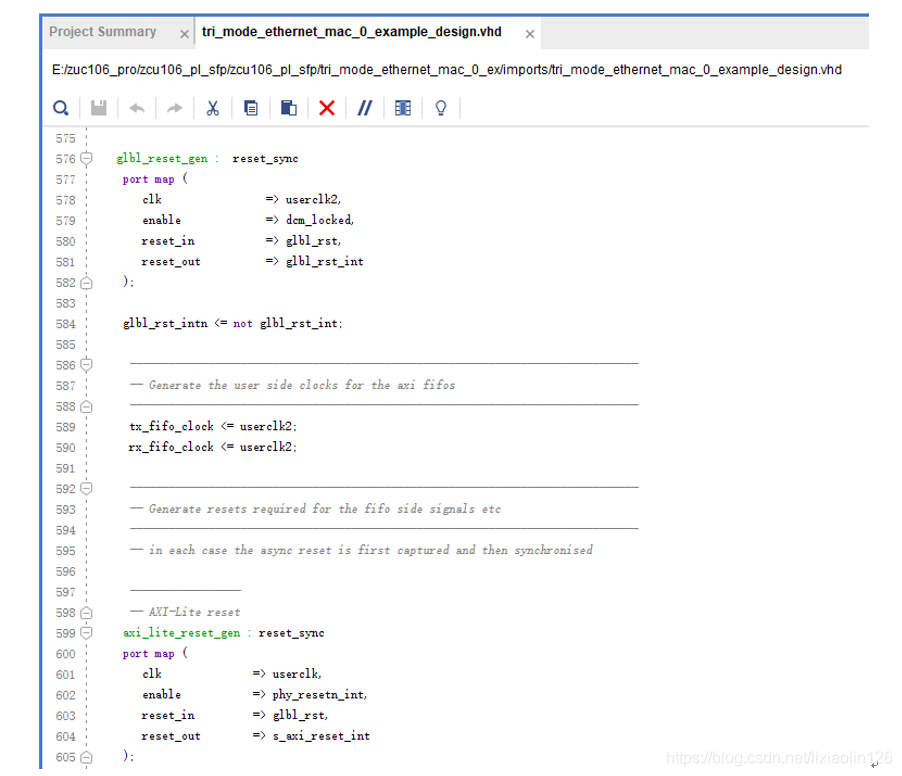
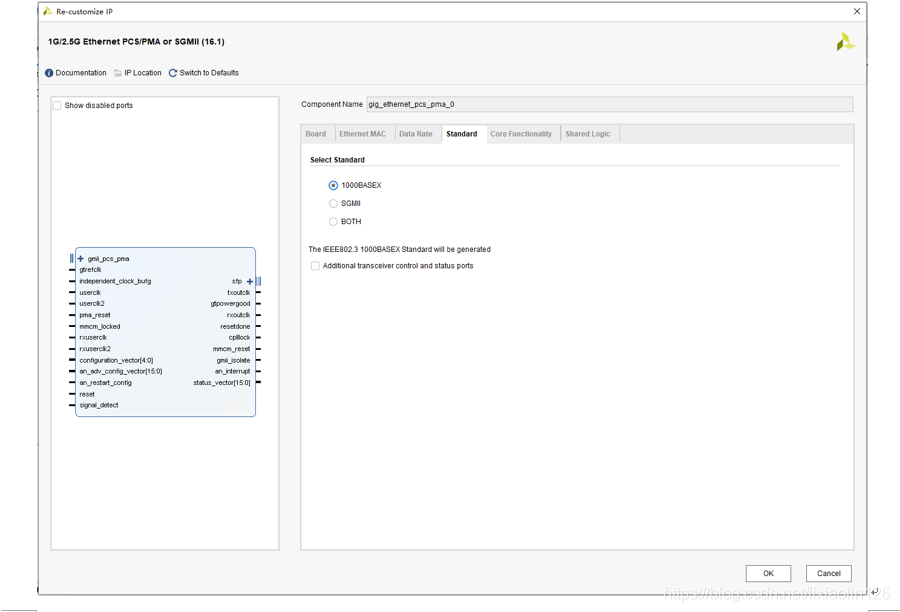
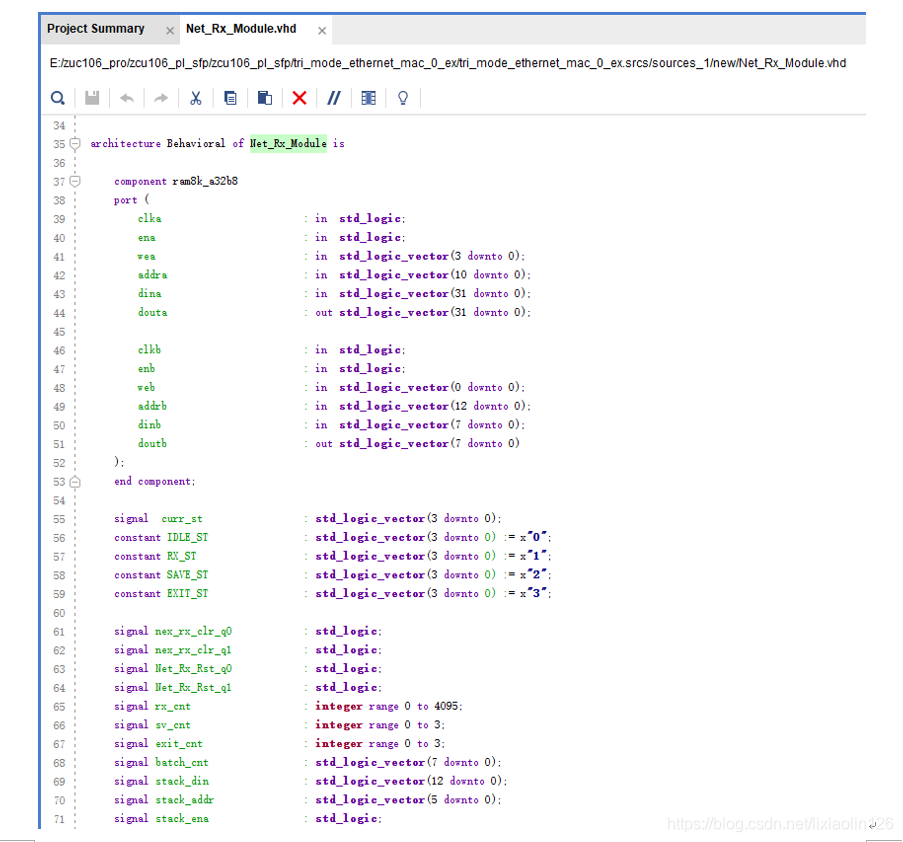
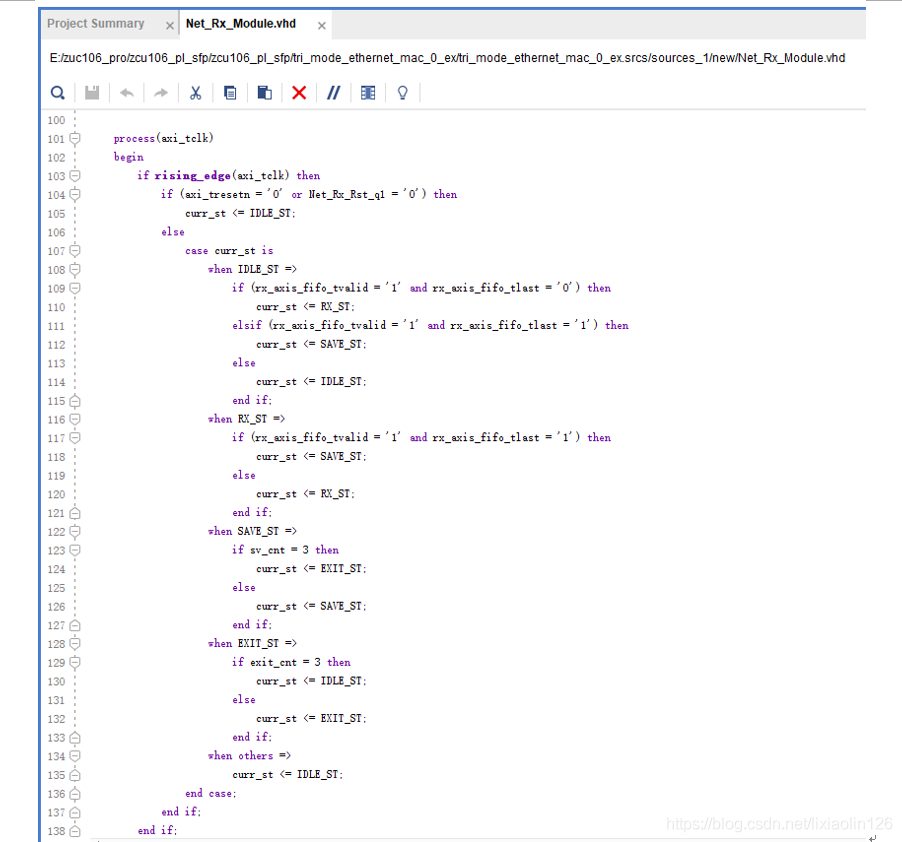
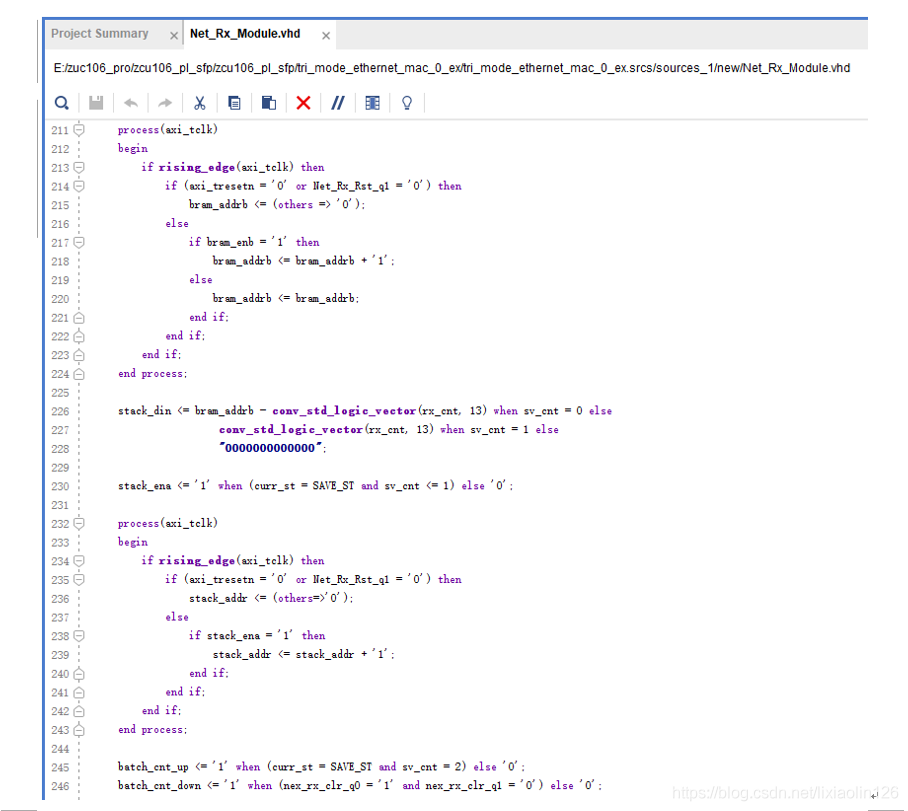

# ZCU106 SFP

## 1. PS 

Zynq 核的设置。其他部分使用默认设置。

axi_bram_ctr_0 设置：

axi_bram_ctr_1 的设置：

axi_bram_ctr_2 的设置：

    在 Vivado 2020.1 中，AXI BRAM Controller 版本为 4.1，默认深度为 2K。

Adjust `Master Base Address` in Address Editor：

Make the `BRAM_PORTA` on BRAM controllers external, double click the ports, set `READ WRITE MODE` of the ports to `READ WRITE`.

Validate the Block Design, and create HDL Wrapper.

## 2. PL

ss

